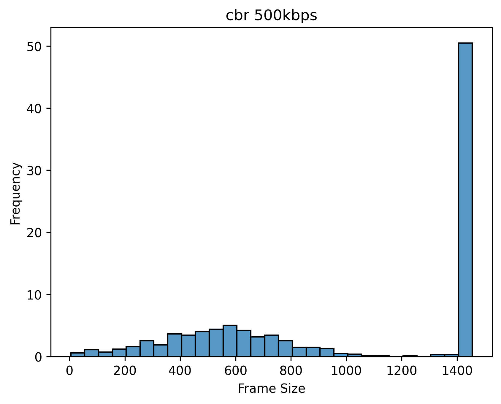

# 视频直播传输中的包长分布

## 问题

RS码这样的代数FEC码要求数据包长度相同，但是视频直播传输场景中，为了降低延迟，一帧编码完成后就会发送，此时最后一个包可能小于MTU。

## 实现分析

在ringmaster encoder的实现中，一帧在编码完成后就会按MTU进行分片，随后加入发送队列。

```cpp
  while ((encoder_pkt = vpx_codec_get_cx_data(&context_, &iter))) {
    if (encoder_pkt->kind == VPX_CODEC_CX_FRAME_PKT) {
      frames_encoded++;

      // there should be exactly one frame encoded
      if (frames_encoded > 1) {
        throw runtime_error("Multiple frames were encoded at once");
      }

      frame_size = encoder_pkt->data.frame.sz;
      assert(frame_size > 0);

      // read the returned frame type
      auto frame_type = FrameType::NONKEY;
      if (encoder_pkt->data.frame.flags & VPX_FRAME_IS_KEY) {
        frame_type = FrameType::KEY;

        if (verbose_) {
          cerr << "Encoded a key frame: frame_id=" << frame_id_ << endl;
        }
      }

      // total fragments to divide this frame into
      const uint16_t frag_cnt = narrow_cast<uint16_t>(
          frame_size / (Datagram::max_payload + 1) + 1);

      // next address to copy compressed frame data from
      uint8_t * buf_ptr = static_cast<uint8_t *>(encoder_pkt->data.frame.buf);
      const uint8_t * const buf_end = buf_ptr + frame_size;

      for (uint16_t frag_id = 0; frag_id < frag_cnt; frag_id++) {
        // calculate payload size and construct the payload
        const size_t payload_size = (frag_id < frag_cnt - 1) ?
            Datagram::max_payload : buf_end - buf_ptr;

        // enqueue a datagram
        send_buf_.emplace_back(frame_id_, frame_type, frag_id, frag_cnt,
          string_view {reinterpret_cast<const char *>(buf_ptr), payload_size});

        buf_ptr += payload_size;
      }
    }
  }
```

## 统计

使用`ringmaster`发送`ice_4cif_30fps.y4m`进行测试，在`sender`发包前将`Datagram`的编号和大小输出至文件。

```csv
frame_id,frame_size,frag_id,frag_cnt
0, 1455, 0, 8
0, 1455, 1, 8
0, 1455, 2, 8
0, 1455, 3, 8
0, 1455, 4, 8
0, 1455, 5, 8
0, 1455, 6, 8
0, 480, 7, 8
1, 1455, 0, 2
1, 269, 1, 2
2, 1455, 0, 2
2, 644, 1, 2
3, 1455, 0, 2
3, 563, 1, 2
4, 1455, 0, 2
4, 426, 1, 2
5, 1455, 0, 2
5, 486, 1, 2
6, 1455, 0, 2
6, 573, 1, 2
7, 1455, 0, 2
7, 399, 1, 2
8, 1455, 0, 2
8, 629, 1, 2
```

- 可以看出，每帧的前面的包体积均为1455，最后一个包体积小于1455。

    绘制直方图：

    

    此条件下只有50%左右的包大小为1455。

- 根据上述分析，可以推测，如果每帧的数据量增大，那么最后一个包的数量占比会下降。故测试码率为1000kbps时的情况：

    

    此时有70%左右的包大小为1455。

## 优化

[TODO] 如果允许引入1帧的延迟，发送端可以等待下一帧编码完成后再发送，能在多大程度上降低短包的占比？

[TODO] 除了填充，还有什么处理不等长包的方法？

[TODO] Tambur是如何处理此问题的？