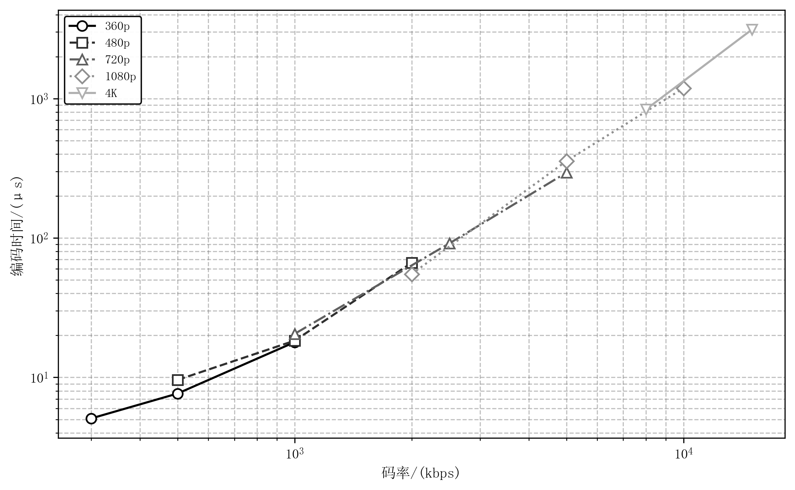

# RLNC编码性能测试结果

## 测试环境

- 测试帧数: 100帧/配置
- 冗余率: 20%
- MTU: 1200 bytes
- 帧大小模拟: I帧(每30帧)为平均的3-5倍，P帧为平均的0.3-1.2倍

## 编码时间 vs 码率

## 测试数据

| 分辨率 | 码率 | 帧大小范围 | 平均编码时间 | 最大编码时间 | CPU开销 |
|--------|------|------------|--------------|--------------|---------|
| 360p | 300 kbps | 0-5KB | 5.08 μs | 45.25 μs | 0.02% |
| 360p | 500 kbps | 0-9KB | 7.66 μs | 70.87 μs | 0.02% |
| 360p | 1000 kbps | 1-20KB | 17.89 μs | 266.33 μs | 0.05% |
| 480p | 500 kbps | 0-9KB | 9.59 μs | 83.59 μs | 0.03% |
| 480p | 1000 kbps | 1-20KB | 18.34 μs | 260.43 μs | 0.06% |
| 480p | 2000 kbps | 2-40KB | 66.35 μs | 1047.11 μs | 0.20% |
| 720p | 1000 kbps | 1-18KB | 20.52 μs | 291.57 μs | 0.06% |
| 720p | 2500 kbps | 3-50KB | 91.46 μs | 1461.94 μs | 0.27% |
| 720p | 5000 kbps | 6-84KB | 294.32 μs | 4382.38 μs | 0.88% |
| 1080p | 2000 kbps | 2-35KB | 55.12 μs | 798.73 μs | 0.17% |
| 1080p | 5000 kbps | 6-99KB | 356.43 μs | 6116.74 μs | 1.07% |
| 1080p | 10000 kbps | 12-163KB | 1187.08 μs | 17375.48 μs | 3.56% |
| 4K | 8000 kbps | 9-150KB | 833.97 μs | 14438.29 μs | 2.50% |
| 4K | 15000 kbps | 18-283KB | 3129.25 μs | 62001.63 μs | 9.39% |

## 说明

- CPU开销 = 平均编码时间 / 帧预算时间 × 100%
- 帧预算 = 1000ms / 30fps ≈ 33.3ms
