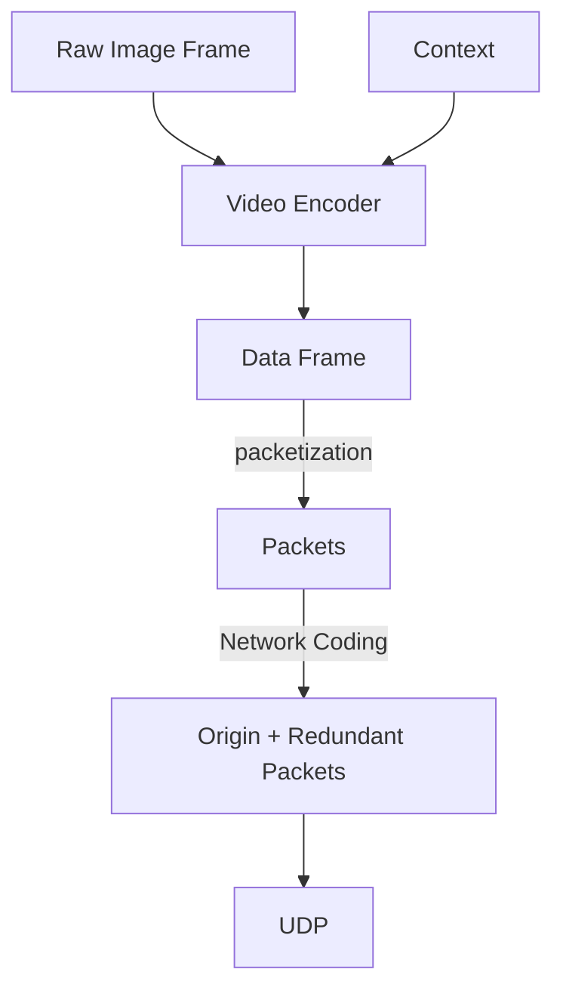

# CSLNC Video Streamer

## Framework

```mermaid
graph TD
    A["Raw Image Frame"] --> B["Video Encoder"]
    C["Context"] --> B
    B --> D["Data Frame"]
    D -->|"packetization"| E["Packets"]
    E -->|"Network Coding"| F["Origin + Redundant Packets"]
    F --> G["UDP"]
```