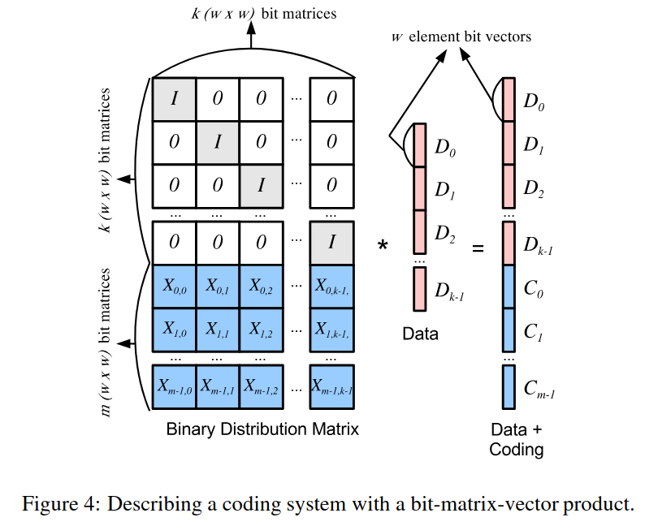

# Jerasure Lib Notes

https://github.com/tsuraan/Jerasure/blob/master/Manual.pdf

## Encoding

- Encoding is achieved by multiplying the data by a matrix of size k x m, where k is the number of data chunks and m is the number of parity chunks. appending the m parity chunks to the data chunks gives the (k+m) encoded chunks.

- If the code is MDS (Maximum Distance Separable), which means any k rows of the encoding matrix are invertable, then the original data can be recovered from any k of the (k+m) encoded chunks.

### Bitmatrix Encoding

- The operations are performed on Finite Fields.

#### Abstract Algebra Recap

- Group abstracts the notion of "addition". 
    All we care for is a set of elements and a binary operation that satisfies the following properties:
    1. Closure
    2. Associativity
    3. Identity

    The physical meaning of the elements can be anything. For example, the elements can be geometric transformations(Rubik's cube), or permutations of a set of objects, or even numbers.

- Field abstracts the notion of "multiplication".
    Field is a set of elements with two binary operations, addition and multiplication, each satisfying the properties of a group. Additionally, the two operations have to satisfy the commutative property and the distributive property.

    Galois have proved that only fields with integer power of prime number of elements exist and is unique for each number. The field with 2^w elements is denoted as GF(2^w).

    One simple way to find the field is by constructing a polynomial with coefficients in GF(2) and then modding out by an irreducible polynomial of degree w. This resembles the construction of integers mod n where n is a prime number.

We can convert a GF(2^w) element multiplication to a GF(2) matrix multiplication.

### Schedule

Schedule speeds up the multiplication of a fix matrix with different data chunks. For a sparse encoding matrix, the multiplication is equivalent to XORing certain bits of the data chunks.

## Using the library

- Install the lib with dependencies via apt: `sudo apt-get install libjerasure-dev`
    - This will install libjersaure2, libjerasure-dev and libgf-complete-dev.

- The lib cannot be found by cmake find_package or pkg-config. So, we have to manually add the include and lib paths to the compiler.
    - Include header files: `-I/usr/include/jerasure/`
    - Link the lib: `-lJerasure -lgf_complete`

- The source repo provides examples for encoding and decoding.
    - [jerasure_07](https://github.com/tsuraan/Jerasure/blob/master/Examples/jerasure_07.c) provides a complete example using cauchy matrix and schedule.
    - Other examples demonstrate the details of reed-solomon, cauchy matrix and some RAID-6 codes.